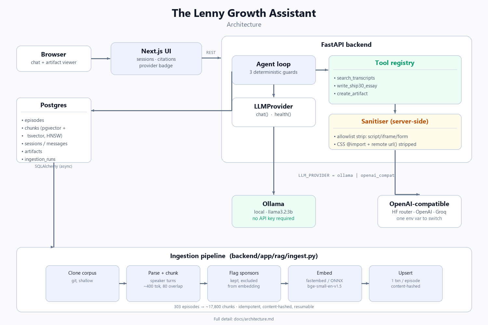

# The Lenny Growth Assistant



A grounded conversational assistant over [Lenny's Podcast](https://www.lennyspodcast.com/)
transcripts. Ask product and growth questions and get answers cited back to the
episode and timestamp they came from; ask for a Ship 30 for 30-style essay or a
document and it renders beside the chat.

Runs entirely on your machine. No API key required.

---

## Contents

- [What it does](#what-it-does)
- [Repository structure](#repository-structure)
- [How this maps to the assignment brief](#how-this-maps-to-the-assignment-brief)
- [Quick start](#quick-start)
- [Architecture at a glance](#architecture-at-a-glance)
- [Configuration](#configuration)
- [Switching models](#switching-models)
- [Testing](#testing)
- [Troubleshooting](#troubleshooting)
- [Operating and extending](#operating-and-extending)
- [Documentation](#documentation)

---

## What it does

| Capability | Notes |
|---|---|
| **Grounded Q&A** | Hybrid retrieval over 303 episodes. Every answer cites episode, guest, and a timestamped YouTube deep link. |
| **Honest refusal** | If nothing in the corpus clears the relevance floor, it says so instead of answering from the model's own knowledge. |
| **Ship 30 essays** | A ~1,250-word essay skill with encoded writing principles and a programmatic quality gate. |
| **Artifacts** | Markdown or HTML/CSS documents rendered in a sandboxed panel beside the chat. |
| **Sessions** | Independent conversations, persisted in Postgres with full history and provenance. |
| **Model toggle** | Local Ollama or any OpenAI-compatible cloud endpoint, switched by one env var. |

---

## Repository structure

```
.
├── backend/
│   ├── app/
│   │   ├── agent/           # runtime.py (the agent loop + 3 deterministic guards),
│   │   │                     prompts.py (system prompt, guard text), tools.py (registry)
│   │   ├── api/              # FastAPI routers: chat, sessions, artifacts, health
│   │   ├── db/                # SQLAlchemy models + async session lifecycle
│   │   ├── llm/                # LLMProvider interface + Ollama / OpenAI-compat / registry
│   │   ├── evals/                  # retrieval eval + agent-scenario harness
│   │   ├── rag/                  # chunking, embeddings, hybrid retriever, ingestion CLI
│   │   ├── schemas/                # Pydantic request/response contracts
│   │   ├── security/                # HTML/Markdown sanitiser (see architecture.md#security)
│   │   ├── skills/ship30/             # principles.md (data) + skill.py (pipeline)
│   │   ├── config.py, logging.py, main.py
│   ├── alembic/                # one migration: the full schema
│   ├── tests/                  # 134 tests -- see docs/architecture.md#testing-strategy
│   └── Dockerfile, requirements*.txt
├── frontend/
│   ├── app/                  # Next.js app router: layout, page, global styles
│   ├── components/            # ArtifactViewer (the sandboxed renderer), Composer,
│   │                            MessageBubble, ProviderBadge, SessionSidebar
│   ├── lib/                    # typed API client + shared types
│   └── Dockerfile
├── docs/
│   ├── PRD.md                # discovery brief, success metrics, scope, risks
│   ├── architecture.md        # schema, request lifecycle, security, deployment
│   ├── design.md                # UI/UX principles, states, accessibility
│   └── test-plan.md              # manual UI test plan
├── agent-transcripts/         # 11 entries: real defects (incl. 2 live hallucinations) found, fixed
├── docker-compose.yml
└── .env.example
```

---

## How this maps to the assignment brief

For an evaluator checking requirements against implementation directly:

| Brief section | Where it's satisfied |
|---|---|
| 3.1 API, sessions, persistence | FastAPI (`backend/app/api/`), sessions scoped at the query level (`routes_sessions.py`), Postgres via SQLAlchemy (`db/models.py`) |
| 3.2 Flexible LLM configuration | `LLMProvider` interface (`llm/base.py`), Ollama + OpenAI-compatible adapters, one env var toggle -- see [Switching models](#switching-models) |
| 3.3 Knowledge base | 303-episode corpus, chunked on speaker turns, embedded, indexed (pgvector HNSW + Postgres FTS) -- see [architecture.md#ingestion-and-retrieval-flow](docs/architecture.md#ingestion-and-retrieval-flow) |
| 4.1 Grounded conversational assistant | Hybrid retrieval + hard grounding floor + forced-retrieval and ungrounded guards, including a tool-call-level guard closing a real live hallucination path -- see [architecture.md#agent-layer](docs/architecture.md#agent-layer); grounding rate, false-ground rate, and agent-level routing correctness all actually measured, not just claimed -- see [Evaluation](#evaluation) |
| 4.2 Ship 30 for 30 skill | `backend/app/skills/ship30/` -- principles as data, outline→draft→rubric→revise pipeline |
| 4.3 Artifact generation + viewer | `create_artifact` tool + `ArtifactViewer.tsx`, sandboxed rendering -- see [architecture.md#security](docs/architecture.md#security) |
| 5. Deployment & operational readiness | One-command `docker compose up`, `.env.example`, structured logs, `/health/deep`, this README's [Troubleshooting](#troubleshooting) |
| 6.1 Public GitHub repository | This repository |
| 6.2 README.md | This file |
| 6.3 PRD | [docs/PRD.md](docs/PRD.md) |
| 6.4 design.md | [docs/design.md](docs/design.md) |
| 6.5 architecture.md | [docs/architecture.md](docs/architecture.md) |
| 6.6 Agent transcripts | [agent-transcripts/](agent-transcripts/) -- 11 entries, including 4 real defects found and fixed by running the system live (2 of them live hallucinations caught by the agent harness) and a real grounding-threshold defect caught by the retrieval eval harness |
| 6.7 Tests | 134 automated tests -- see [Testing](#testing) -- plus a 24-question retrieval eval harness and an 8-scenario agent harness ([Evaluation](#evaluation)) and [docs/test-plan.md](docs/test-plan.md) |
| 6.8 Demo video | Not part of this repository; recorded separately per the submission instructions |

---

## Quick start

### Prerequisites

- **Docker Desktop** (or Docker Engine + Compose v2)
- **[Ollama](https://ollama.com/download)** running on the host
- ~8GB free disk, ~6GB free RAM
- No API key needed

### Three commands

```bash
ollama pull llama3.2:3b
```

```bash
cp .env.example .env
```

```bash
docker compose up --build
```

Then open **http://localhost:3000**.

On first boot the backend runs its migrations and then seeds the knowledge base
in the background — cloning the transcript corpus, chunking 303 episodes, and
embedding ~17,800 passages. Measured on a 16-thread CPU-only box, embedding the
**full corpus takes several hours** — CPU-bound transformer inference at this
scale is genuinely slow without a GPU, and no software fix changes that. The UI
shows a banner while it runs and un-blocks itself as soon as the first episodes
land, so partial answers are available well before the full run finishes; you
never need to reload. Watch progress with:

```bash
docker compose logs -f backend
```

**For a fast smoke test** rather than the full corpus, ingest a small subset
instead by overriding the limit for one run:

```bash
docker compose exec -e INGEST_EPISODE_LIMIT=40 backend python -m app.rag.ingest
```

or set `INGEST_EPISODE_LIMIT=40` in `.env` before first boot. Ingestion is
idempotent and content-hashed, so running it again later with the limit raised
(or removed) only embeds what is missing — it never redoes finished episodes.

### Verify it worked

```bash
curl -s http://localhost:8000/health/deep | python -m json.tool
```

You want `"status": "ok"`, your provider `"healthy": true`, and
`knowledge_base.ready: true`.

---

## Architecture at a glance

```
┌──────────────┐      ┌─────────────────────────────────────┐      ┌────────────┐
│  Next.js UI  │─────▶│            FastAPI                  │─────▶│  Postgres  │
│              │      │                                     │      │ + pgvector │
│ chat +       │◀─────│  ┌────────────┐   ┌──────────────┐  │◀─────│            │
│ artifact     │      │  │ Agent loop │──▶│ Tool registry│  │      │ episodes   │
│ viewer       │      │  └─────┬──────┘   ├──────────────┤  │      │ chunks     │
└──────────────┘      │        │          │ search       │  │      │ sessions   │
                      │        │          │ ship30 essay │  │      │ messages   │
                      │        │          │ artifact     │  │      │ artifacts  │
                      │        │          └──────────────┘  │      └────────────┘
                      │        ▼                            │
                      │  ┌──────────────┐                   │
                      │  │ LLMProvider  │                   │
                      │  └──────┬───────┘                   │
                      └─────────┼───────────────────────────┘
                                │
                   ┌────────────┴────────────┐
                   ▼                         ▼
            ┌─────────────┐          ┌───────────────┐
            │   Ollama    │          │ OpenAI-compat │
            │  (local)    │          │ (HF / OpenAI) │
            └─────────────┘          └───────────────┘
```

Full detail, including the database schema and every endpoint, is in
[docs/architecture.md](docs/architecture.md).

### One deviation from the brief, stated plainly

The assignment suggests building the agent layer on the **Claude Agent SDK** or
**Pi Coding Agent**, and *also* requires the submitted demo to run on local
Ollama. Neither SDK executes against an Ollama endpoint, so building directly on
one would have left the mandatory demo path unimplementable.

The agent is therefore implemented against an internal `LLMProvider` interface
with a shared tool registry, so a single identical code path serves local and
cloud. The cost is that session and tool plumbing the SDKs would have supplied
is written here instead. The reasoning is in
[docs/architecture.md](docs/architecture.md#agent-layer).

---

## Configuration

Every knob is an environment variable; see [.env.example](.env.example) for the
annotated list. The values you are most likely to touch:

| Variable | Default | Purpose |
|---|---|---|
| `LLM_PROVIDER` | `ollama` | `ollama` (local) or `openai_compat` (cloud) |
| `OLLAMA_MODEL` | `llama3.2:3b` | Local model |
| `OLLAMA_BASE_URL` | `http://host.docker.internal:11434` | Reaches host Ollama from the container |
| `LLM_BASE_URL` | HF router | Cloud endpoint |
| `LLM_MODEL` / `LLM_API_KEY` | — | Cloud model and key |
| `LLM_FALLBACK_PROVIDER` | `none` | Provider to retry on if the primary is down |
| `RETRIEVAL_MIN_SIMILARITY` | `0.55` | Grounding floor — raise to decline more readily |
| `DATABASE_URL` | local Compose | Swap for Supabase/Railway with no code change |
| `INGEST_ON_STARTUP` | `true` | Auto-seed the corpus on first boot |
| `LOG_FORMAT` | `console` | `json` for machine-readable logs |

**Secrets are never committed.** `.env` is gitignored; `.env.example` ships with
safe defaults and an empty `LLM_API_KEY`.

---

## Switching models

### Local (default — this is what the demo runs on)

```bash
ollama pull qwen2.5:7b-instruct
```

Set `OLLAMA_MODEL=qwen2.5:7b-instruct` in `.env` and restart the backend.

| Model | Size | CPU-only speed | Best for |
|---|---|---|---|
| `llama3.2:3b` | 2.0GB | Usable | Demos, fast iteration |
| `qwen2.5:7b-instruct` | 4.7GB | Slow (~3–6 tok/s) | Better long-form essays |

### Cloud

The adapter speaks the OpenAI `/v1/chat/completions` contract, so one code path
covers several providers. Set three variables and restart:

```
LLM_PROVIDER=openai_compat
LLM_BASE_URL=https://router.huggingface.co/v1
LLM_MODEL=Qwen/Qwen3-32B
LLM_API_KEY=hf_your_token
```

Other tested endpoints: `https://api.openai.com/v1`,
`https://api.groq.com/openai/v1`, `https://openrouter.ai/api/v1`.

The active provider is shown as a badge in the UI header and returned by
`GET /api/config`, so you can always see which model actually answered.

### Fallback

Set `LLM_FALLBACK_PROVIDER` to have the app retry on a second provider when the
primary is unreachable or times out. Auth failures and malformed responses
deliberately do **not** trigger fallback — those are configuration bugs, and
masking them makes the system harder to operate.

---

## Testing

```bash
docker compose exec backend python -m pytest -q
```

Or on the host:

```bash
cd backend && pip install -r requirements-dev.txt && python -m pytest -q
```

Database-backed tests need a test database:

```bash
docker compose exec postgres createdb -U lenny lenny_test
```

Tests skip with a clear reason when no database is reachable, so `pytest` stays
useful on a bare laptop. The manual UI test plan is in
[docs/test-plan.md](docs/test-plan.md).

### Evaluation

Tests verify the code; this verifies the *system* against the PRD's actual
success metric and guardrail, using a 24-question labeled golden set run
against the real retriever and the real corpus:

```bash
docker compose exec backend python -m app.evals.run_eval
```

Reports Grounded Answer Rate (target ≥ 80%), False-Ground Rate on
out-of-domain questions (must be 0%), guest-match precision, and retrieval
latency — and exits non-zero if either threshold is violated. The first run
of this harness found a real defect: an under-tuned similarity floor let 80%
of out-of-domain questions incorrectly ground. Full account in
[docs/architecture.md#evaluation](docs/architecture.md#evaluation) and
`agent-transcripts/10`.

A sibling harness tests the agent loop itself, not just retrieval -- real
model, real tool registry, real guards, against 8 golden conversations:

```bash
docker compose exec backend python -m app.evals.run_agent_eval             # full run (~15 min, includes the essay)
docker compose exec backend python -m app.evals.run_agent_eval --exclude-slow  # fast scenarios only
```

Its first run found two live hallucinations: asked for a sourdough recipe or
checklist, the model skipped retrieval entirely and rendered fabricated
content as a legitimate artifact. Fixed, and now covered by a permanent
regression test in every case. Full account in
[docs/architecture.md#agent-scenario-evaluation](docs/architecture.md#agent-scenario-evaluation)
and `agent-transcripts/11`.

---

## Troubleshooting

**`Cannot reach Ollama` / `llm_unavailable`**

Ollama binds to IPv4 only. `localhost` resolves to `::1` on many systems and
will fail — use `127.0.0.1` when running the backend outside Docker.

```bash
curl http://127.0.0.1:11434/api/tags
```

If that fails, start it with `ollama serve`. From inside Docker the correct host
is `host.docker.internal`, which Compose already wires up.

**`Model 'x' is not present in Ollama`**

```bash
ollama pull llama3.2:3b
```

**Answers say the transcripts don't cover anything**

The knowledge base is probably still seeding. Check:

```bash
curl -s http://localhost:8000/health/deep | python -m json.tool
```

If `knowledge_base.ready` is `false`, watch `docker compose logs -f backend`. If
ingestion failed, re-run it by hand:

```bash
docker compose exec backend python -m app.rag.ingest
```

**Everything is slow**

Expected on CPU. A 3B model answers in roughly 10–30s; a 7B model can take
minutes. Use `llama3.2:3b`, or point at a cloud provider.

**Is it retrieval or the model?**

Query retrieval directly, with no model in the loop:

```bash
curl -s -X POST http://localhost:8000/api/search -H 'Content-Type: application/json' -d '{"query":"product market fit"}' | python -m json.tool
```

Good `similarity` scores here mean retrieval is fine and the problem is the
model or the prompt.

**Port already in use**

Change the host-side port mappings in `docker-compose.yml` (`5432`, `8000`, `3000`).

---

## Operating and extending

**Refresh the corpus.** Ingestion is idempotent — episodes are content-hashed,
so unchanged ones are skipped and only new or edited episodes are re-embedded.
Safe to run on a schedule:

```bash
docker compose exec backend python -m app.rag.ingest
```

**Audit what happened.** Every run writes an `ingestion_runs` row with counts,
status, and any error.

**Observability.** Structured logs with a `request_id` on every line, traceable
across API, retrieval, model call, and persistence. Set `LOG_FORMAT=json` to
ship them anywhere.

**Add a tool.** Add a `ToolSpec` and an implementation in
[backend/app/agent/tools.py](backend/app/agent/tools.py) and register it in
`TOOL_IMPLEMENTATIONS`. Keep the set small — routing accuracy on small local
models degrades measurably with each additional tool.

**Change the writing style.** Edit
[backend/app/skills/ship30/principles.md](backend/app/skills/ship30/principles.md).
It is data, not code; no Python changes needed.

**Add a provider.** Implement `LLMProvider` in `backend/app/llm/` and register it
in `registry.py`. Nothing above the interface changes.

---

## Documentation

| Document | Contents |
|---|---|
| [docs/PRD.md](docs/PRD.md) | Discovery brief, user, success metrics, assumptions, scope, risks |
| [docs/architecture.md](docs/architecture.md) | Schema, endpoints, ingestion, routing, security, deployment |
| [docs/design.md](docs/design.md) | UI/UX principles, information architecture, states, accessibility |
| [docs/test-plan.md](docs/test-plan.md) | Manual UI test plan |
| [agent-transcripts/](agent-transcripts/) | Coding-agent session logs, including failures and corrections |

---

## Data and licensing

Transcripts come from
[ChatPRD/lennys-podcast-transcripts](https://github.com/ChatPRD/lennys-podcast-transcripts)
and are **cloned at runtime, not vendored** — this repository contains no
third-party content. The upstream archive states the transcripts are provided
for personal and educational use; all content belongs to Lenny's Podcast and the
respective guests. This project is a technical demonstration and is not
affiliated with or endorsed by Lenny's Podcast.
